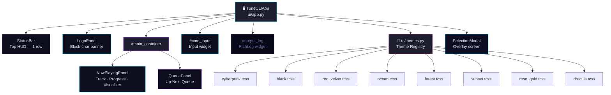
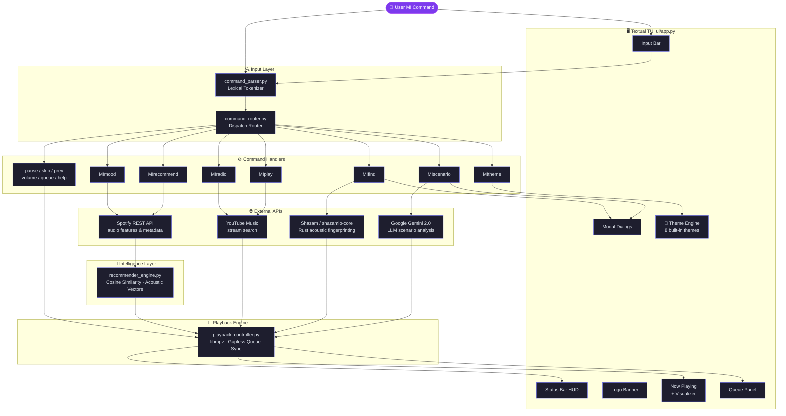

<div align="center">

# 🎵 TuneCLI
### *The Ultimate AI-Driven Terminal Audio Engine*

[](https://www.python.org/)
[](https://www.rust-lang.org/)
[](LICENSE)
[](https://mpv.io/)
[](https://textual.textualize.io/)
[](#-theme-system)

**TuneCLI** is an ultra-fast, intelligent, and highly experimental terminal music environment built for developers, audiophiles, and terminal purists.

By fusing **YouTube Music's vast library**, **Spotify's machine-learning audio features**, and **Rust-compiled Acoustic Fingerprinting**, TuneCLI delivers a seamless, mood-aware, and futuristic listening experience completely from the command line — now wrapped in a stunning **multi-theme Textual TUI** with 8 built-in colour themes.

</div>

---

## ✨ Engineering Highlights

- 🎧 **Machine Learning & Audio Analysis**: Leverages Spotify's audio feature vectors and **Cosine Similarity** algorithms to curate mathematically perfect song transitions and recommendations based on track acoustics (valence, energy, tempo).
- ✨ **LLM-Driven Scenario Soundtracking**: Integrates **Google Gemini 2.0** to analyze free-form user stories. Describe your situation (e.g., "Driving through the rain in Tokyo"), and TuneCLI will extract the mood, tone, and language to build a tailored 5-track scenario queue.
- 🎙️ **Ambient Audio Fingerprinting**: Built-in Rust-powered acoustic recognition engine (`M!find`). Listen to your surroundings through your microphone, instantly identify the playing track via Shazam's hashing algorithms, and natively queue it or its nearest AI neighbors.
- 🖥️ **Multi-Theme Terminal UI**: A fully reactive, multi-zone **Textual TUI** with a live status bar HUD, animated visualizer, dynamic queue panel, block-character logo banner, Now Playing display, and interactive modal dialogs — switchable across **8 built-in colour themes** at runtime with `M!theme`.
- 🚀 **High-Performance Architecture**:
  - Asynchronous event loops for non-blocking I/O.
  - Native `libmpv` hooks via ctypes for gapless playback without heavy unoptimized wrappers.
  - Rust-compiled core dependencies (`shazamio-core`) for CPU-efficient signal processing.

---

## 🚀 Quick Start & Installation

### Prerequisites
- **Python 3.10+** (Python 3.13 supported)
- **Rust Toolchain (`Cargo`)**: Required for compiling the audio processing core.
- **MPV Core**: Required for hardware-accelerated playback.

### Setup
1. Clone the repository:
   ```bash
   git clone https://github.com/hemahariharan1126/tunecli.git
   cd tunecli
   ```
2. Install dependencies (this will automatically compile the Rust acoustic engines if pre-built wheels are unavailable on your architecture):
   ```bash
   pip install -r requirements.txt
   ```
3. Initialize API Secrets (Optional but recommended for AI Recommendations):
   Create a `.env` file in the root directory.
   ```env
   SPOTIFY_CLIENT_ID='your_id'
   SPOTIFY_CLIENT_SECRET='your_secret'
   GEMINI_API_KEY='your_gemini_api_key'
   ```
4. Launch TuneCLI:
   ```bash
   python main.py
   ```

---

## ⌨️ Command Interface

Navigate TuneCLI using an intuitive, context-aware command parser prefixed with `M!`.

| Command | Feature |
| :--- | :--- |
| `M!find` | **Ambient Recognition.** Records microphone audio, identifies the playing song, and allows instant native playback. |
| `M!scenario <story>`| **Story-Based Soundtrack.** Describe your situation, and LLM-driven AI will build a matching queue. |
| `M!play <query>` | AI-assisted search and instant gapless playback. |
| `M!recommend` | Computes acoustic vectors of the current track to fetch and queue its nearest Spotify neighbors. |
| `M!mood <mood>` | Mutate the queue using semantic mood filters (`sad`, `chill`, `party`, `focus`). |
| `M!radio <song>` | Infinite algorithmic generation of related tracks. |
| `M!pause` / `M!resume` | Control playback lifecycle. |
| `M!skip` / `M!prev` | Navigate the dynamic queue. |
| `M!queue` | View the up-next state tree. |
| `M!volume <0-100>` | Manipulate the MPV audio bus. |
| `M!theme <name>` | **Switch colour theme at runtime.** 8 built-in themes, persisted across restarts. |
| `M!help` | Advanced command syntax reference. |

---

## 🖥️ TUI Layout

TuneCLI features a fully reactive, multi-zone **Textual TUI**:

```
┌─────────────────────────────────────────────────────┐
│  ⚡ M! TuneCLI  │  RADIO:OFF  │  QUEUE: 0  │  VOL  │  ← Status Bar HUD
├─────────────────────────────────────────────────────┤
│  ████████╗██╗   ██╗███╗   ██╗███████╗               │
│  ╚══██╔══╝██║   ██║████╗  ██║██╔════╝               │  ← Logo Banner
│     ██║   ...                                        │
├─────────────────────────┬───────────────────────────┤
│  ◈  NOW PLAYING         │  ◈  UP NEXT               │
│                         │                           │
│  ▶  Song Title          │  1. Track One             │  ← Main Panels
│     🎤 Artist Name      │  2. Track Two             │
│  ▓▓▓▓▓░░░░░  03:42      │  ...                      │
│  ████░░░░░░  80%  🔊    │                           │
├─────────────────────────┴───────────────────────────┤
│  [ ⚡  M!play <song>  ·  M!help  ·  M!theme black ] │  ← Command Input
├─────────────────────────────────────────────────────┤
│  ⚡ M! TuneCLI — Ready                              │
│  ◈  THEME → DRACULA  applied & saved.               │  ← Output Log (RichLog)
└─────────────────────────────────────────────────────┘
```

| Zone | Component | Description |
| :--- | :--- | :--- |
| Top | **Status Bar HUD** | Live display of playback state, volume, queue count, and radio mode. |
| Top+1 | **Logo Banner** | Block-character TUNE logo — always visible, theme-aware accent colour. |
| Centre-Left | **Now Playing** | Track info, animated audio visualizer, progress bar, volume bar, mood badge. |
| Centre-Right | **Queue Panel** | Real-time up-next queue with track numbering and dynamic updates. |
| Bottom | **Command Input** | Inline `M!` command input with autocomplete suggestions. |
| Log | **Output Log** | Rich-rendered command output, errors, and system messages. |
| Overlay | **Modal Dialogs** | Confirmation and result modals for commands like `M!find` and `M!scenario`. |

---

## 🎨 Theme System

TuneCLI ships with **8 built-in colour themes**, switchable at runtime with `M!theme <name>`. The selected theme persists across restarts via `.env`.

```bash
M!theme cyberpunk    # default — neon cyan synthwave
M!theme black        # pure black monochrome
M!theme red_velvet   # deep crimson luxe
M!theme ocean        # teal abyss
M!theme forest       # emerald forest night
M!theme sunset       # warm amber glow
M!theme rose_gold    # soft blush pink
M!theme dracula      # classic dev dark
```

### Theme Showcase

| Theme | Accent | Background | Vibe |
| :--- | :---: | :---: | :--- |
| `cyberpunk` ⚡ | `#00d4ff` neon cyan | `#080810` deep navy | Synthwave default |
| `black` 🖤 | `#ffffff` white | `#000000` true black | Minimal monochrome |
| `red_velvet` 🍷 | `#e8234a` crimson | `#1a0008` burgundy | Warm dark luxe |
| `ocean` 🌊 | `#00e5cc` teal | `#020d1a` abyss navy | Cold calm depth |
| `forest` 🌿 | `#39d353` emerald | `#050f06` dark pine | Nature night mode |
| `sunset` 🌇 | `#ff8c00` amber | `#120a00` dark charcoal | Golden hour glow |
| `rose_gold` 🌸 | `#e8a0b0` blush | `#120d0f` dark charcoal | Soft elegant |
| `dracula` 🧛 | `#ff79c6` pink | `#282a36` Dracula bg | Classic dev dark |

> Theme choice is saved to `.env` as `TUNECLI_THEME=<name>` and auto-restored on next launch.

---

## 🏗️ TUI Component Architecture



---

## 🛠️ System Architecture

### Data Flow



### Module Reference

```text
tunecli/
├── api/                # Stateful HTTP clients (Spotify REST, YTMusic, LLM)
├── commands/           # Pluggable CLI command handlers (Controller layer)
│   ├── theme.py        # M!theme — runtime theme switcher
│   └── ...             # play, pause, skip, mood, recommend, scenario, find…
├── conductor/          # UX planning and session orchestration notes
├── core/               # State machines and configuration management
├── parser/             # Lexical parsing and command dispatch routing
├── player/             # libmpv abstractions and queue synchronization
├── recommender/        # ML Vector processing for semantic/acoustic matching
├── search_engine/      # YouTube Music search abstraction
├── ui/                 # Textual TUI — app, components, styles, and themes
│   ├── app.py          # Main Textual app entry point & event loop
│   ├── themes.py       # Theme registry, hot-swap & .env persistence
│   ├── visualizer.py   # Animated multi-color audio visualizer
│   ├── components/     # Modular UI widgets
│   │   ├── logo.py         # LogoPanel — block-char TUNE banner
│   │   ├── status_bar.py   # Always-visible status HUD
│   │   ├── now_playing.py  # Now Playing panel
│   │   ├── queue.py        # Queue display widget
│   │   ├── input.py        # Command input bar
│   │   └── modal.py        # Dialog/modal overlays
│   └── styles/             # TCSS theme stylesheets (8 themes)
│       ├── theme.tcss          # Cyberpunk / Synthwave (default)
│       ├── black.tcss          # Pure Black
│       ├── red_velvet.tcss     # Red Velvet
│       ├── ocean.tcss          # Ocean Deep
│       ├── forest.tcss         # Forest Night
│       ├── sunset.tcss         # Sunset Amber
│       ├── rose_gold.tcss      # Rose Gold
│       └── dracula.tcss        # Dracula
├── utils/              # Shared helpers and command routing
├── logo.txt            # Block-character TUNE logo (loaded by LogoPanel)
└── main.py             # Application Entrypoint
```

---

<div align="center">
Built with ❤️ for the terminal.
<br>
<i>Empowering developers to never leave the CLI for their music again.</i>
</div>
