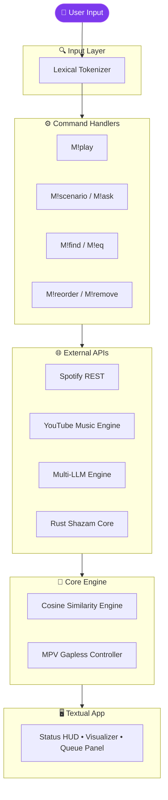

<div align="center">

# 🎵 TuneCLI
### *The Ultimate AI-Driven Terminal Audio Engine*

[](https://www.python.org/)
[](https://www.rust-lang.org/)
[](https://github.com/)
[](https://mpv.io/)
[](https://textual.textualize.io/)

**TuneCLI** is an ultra-fast, intelligent, and highly experimental terminal music environment built for developers, audiophiles, and terminal purists.

By fusing **YouTube Music's vast library**, **Spotify's machine-learning audio features**, **Multi-LLM Intelligence**, and **Rust-compiled Acoustic Fingerprinting**, TuneCLI delivers a seamless, mood-aware, and futuristic listening experience completely from the command line — now wrapped in a stunning **multi-theme Textual TUI**.

[Explore Themes](#-theme-system) • [Installation](#-quick-start--installation) • [Commands](#%EF%B8%8F-command-interface)

<br/>

</div>

---

## ✨ Engineering Highlights

<details open>
<summary><b>🎧 Machine Learning & Acoustic Analysis</b></summary>
Leverages Spotify's audio feature vectors and <b>Cosine Similarity</b> algorithms to curate mathematically perfect song transitions and recommendations based on track acoustics (valence, energy, tempo).
</details>

<details open>
<summary><b>🧠 4-Stage Unstoppable AI Search</b></summary>
A custom-built YouTube scraping engine that guarantees you find the <i>official studio release</i>. If strict audio filters fail, TuneCLI mathematically strips noisy keywords, and finally falls back to a <b>Multi-LLM Engine</b> to intelligently translate vague descriptions (<i>"that one song from titanic"</i>) into perfect metadata searches!
</details>

<details open>
<summary><b>✨ LLM-Driven Scenario Soundtracking</b></summary>
Integrates a <b>flexible Multi-LLM architecture</b> to analyze free-form user stories. Describe your situation (e.g., "Driving through the rain in Tokyo"), and TuneCLI will extract the mood, tone, and language to build a tailored 5-track scenario queue.
</details>

<details open>
<summary><b>🎙️ Ambient Audio Fingerprinting</b></summary>
Built-in Rust-powered acoustic recognition engine (<code>M!find</code>). Listen to your surroundings through your microphone, instantly identify the playing track via Shazam's hashing algorithms, and natively queue it or its nearest AI neighbors.
</details>

<details>
<summary><b>🖥️ Reactive Multi-Theme TUI</b></summary>
A fully reactive, multi-zone Textual TUI with a live status bar HUD, animated visualizer, dynamic queue panel, block-character logo banner, Now Playing display, and interactive modal dialogs — switchable across 8 built-in colour themes at runtime with <code>M!theme</code>.
</details>

---

## 🚀 Quick Start & Installation

### Prerequisites
- **Python 3.10+**
- **Rust Toolchain (`Cargo`)**: Required for compiling the audio processing core.
- **MPV Core**: Required for hardware-accelerated playback (`libmpv`).

### Setup

```bash
# 1. Clone the repository
git clone https://github.com/hemahariharan1126/tunecli.git
cd tunecli

# 2. Install dependencies (compiles Rust engines automatically)
pip install -r requirements.txt

# 3. Launch TuneCLI
python main.py
```

<details>
<summary><b>🔑 Optional: API Secrets (For AI/Spotify Recommendations)</b></summary>

Create a `.env` file in the root directory:
```env
SPOTIFY_CLIENT_ID='your_id'
SPOTIFY_CLIENT_SECRET='your_secret'

# Configure your preferred LLM provider for AI features
LLM_PROVIDER='your_provider'
LLM_API_KEY='your_key'
```
</details>

---

## ⌨️ Command Interface

Navigate TuneCLI using an intuitive, context-aware command parser prefixed with `M!`. 

| Command | Feature |
| :--- | :--- |
| `M!find` | **Ambient Recognition.** Records mic audio, identifies the playing song, and plays it. |
| `M!scenario <story>`| **Story-Based Soundtrack.** Describe your situation to the AI. |
| `M!ask <question>`| **Chat with the Music AI.** Ask about your queue, music history, or get trivia! |
| `M!play <query>` | Gapless playback using the Unstoppable 4-Stage Search engine. |
| `M!recommend` | Computes acoustic vectors of the current track to queue nearest neighbors. |
| `M!mood <mood>` | Mutate the queue using semantic mood filters (`sad`, `chill`, `party`, `focus`). |
| `M!radio <song>` | Infinite algorithmic generation of related tracks. |
| `M!theme <name>` | **Hot-swap UI theme.** 8 built-in themes! |
| `M!eq <preset>` | Apply a 10-band equalizer (e.g., `bass_boost`, `vocal`). |

<details>
<summary><b>View standard playback controls</b></summary>

- `M!pause` / `M!resume`: Control playback lifecycle.
- `M!skip` / `M!prev`: Navigate the dynamic queue.
- `M!queue`: View the up-next state tree.
- `M!remove <index>`: Delete a specific song from the upcoming queue.
- `M!reorder <from> <to>`: Move a song within the queue.
- `M!volume <0-100>`: Manipulate the MPV audio bus.
- `M!help`: Advanced command syntax reference.
</details>

---

## 🎨 Theme System

TuneCLI ships with **8 built-in colour themes**, switchable instantly at runtime with `M!theme <name>`. Your choice persists across restarts via `.env`.

<details>
<summary><b>Click to preview all available themes!</b></summary>

| Theme | Accent | Background | Vibe | Command |
| :--- | :---: | :---: | :--- | :--- |
| `cyberpunk` ⚡ | `#00d4ff` | `#080810` | Synthwave default | `M!theme cyberpunk` |
| `dracula` 🧛 | `#ff79c6` | `#282a36` | Classic dev dark | `M!theme dracula` |
| `black` 🖤 | `#ffffff` | `#000000` | Minimal monochrome | `M!theme black` |
| `red_velvet` 🍷 | `#e8234a` | `#1a0008` | Warm dark luxe | `M!theme red_velvet` |
| `ocean` 🌊 | `#00e5cc` | `#020d1a` | Cold calm depth | `M!theme ocean` |
| `forest` 🌿 | `#39d353` | `#050f06` | Nature night mode | `M!theme forest` |
| `sunset` 🌇 | `#ff8c00` | `#120a00` | Golden hour glow | `M!theme sunset` |
| `rose_gold` 🌸 | `#e8a0b0` | `#120d0f` | Soft elegant | `M!theme rose_gold` |

</details>

---

## 🏗️ Architecture Under the Hood

TuneCLI is built modularly. You can expand it easily by adding new commands to the `commands/` directory.

<details>
<summary><b>View System Data Flow (Mermaid Graph)</b></summary>


</details>

<details>
<summary><b>View Directory Structure</b></summary>

```text
tunecli/
├── api/                # Stateful HTTP clients (Spotify REST, YTMusic, LLM)
├── commands/           # Pluggable CLI command handlers (play, ask, theme, etc.)
├── core/               # State machines and configuration management
├── equalizer/          # 10-band audio equalizer profiles
├── parser/             # Lexical parsing and command dispatch routing
├── player/             # libmpv abstractions and queue synchronization
├── recommender/        # ML Vector processing for semantic/acoustic matching
├── search_engine/      # 4-Stage Iterative Search engine
├── ui/                 # Textual TUI — app, components, styles, and themes
├── utils/              # Shared helpers
├── logo.txt            # Block-character banner
└── main.py             # Application Entrypoint
```
</details>

---

<div align="center">
Built with ❤️ for the terminal.
<br>
<i>Empowering developers to never leave the CLI for their music again.</i>
</div>
